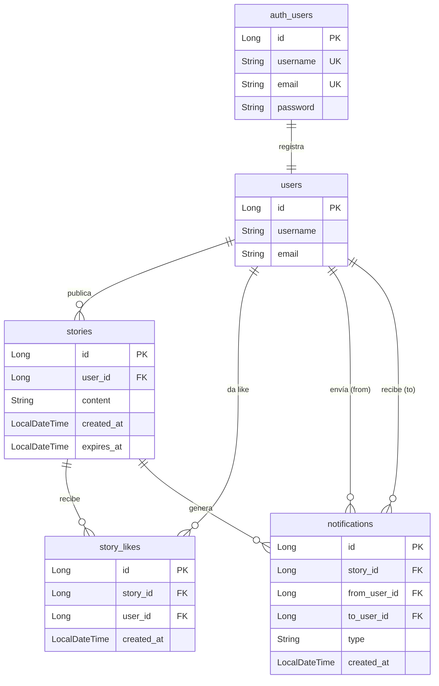

# 🏗️ Backend Architecture

## Diagrama de Arquitectura

```
                        CLIENTE (React)
                              │
                              ▼
                      ┌─────────────┐
                      │ API GATEWAY │  :8080
                      │  Valida JWT │
                      └──────┬──────┘
                             │
          ┌──────────────────┼──────────────────┬─────────────────┐
          │                  │                  │                 │
          ▼                  ▼                  ▼                 ▼
   ┌─────────────┐   ┌─────────────┐   ┌─────────────┐  ┌─────────────┐
   │  AUTH/USER  │   │    STORY    │   │    LIKE     │  │NOTIFICATION │
   │   SERVICE   │   │   SERVICE   │   │   SERVICE   │  │   SERVICE   │
   │    :8083    │   │    :8084    │   │    :8081    │  │    :8082    │
   └──────┬──────┘   └──────┬──────┘   └──────┬──────┘  └──────┬──────┘
          │                  │                  │                │
          └──────────────────┴──────────────────┘                │
                             │                                   │
                             ▼                                   │
   ┌─────────────────────────────────────────────┐              │
   │            PostgreSQL  :5433                │              │
   │  ┌──────────┐ ┌──────────┐ ┌─────────────┐  │              │
   │  │  users   │ │ stories  │ │ story_likes │  │              │
   │  └──────────┘ └──────────┘ └─────────────┘  │              │
   │  ┌─────────────────────────────────────────┐ │              │
   │  │              notifications              │ │◄─────────────┘
   │  └─────────────────────────────────────────┘ │
   └─────────────────────────────────────────────┘
                             │
                             │ like-service publica evento
                             ▼
   ┌─────────────────────────────────────┐
   │           KAFKA  :9092              │
   │   topic: story-liked                │
   │   ┌─────────────────────────────┐   │
   │   │  { storyId, userId, action }│   │
   │   └─────────────────────────────┘   │
   └──────────────────┬──────────────────┘
                      │
                      │ notification-service consume evento
                      ▼
              crea/borra notificación
                 en PostgreSQL
```

---

## 🔄 Flujos Principales

### ❤️ Flujo de un Like

| Paso | Descripción |
|------|-------------|
| 1 | `React` → `POST /api/likes/stories/toggle` *(con JWT)* |
| 2 | **Gateway** valida el JWT |
| 3 | Gateway rutea la petición a **like-service** `:8081` |
| 4 | `like-service` valida que la story existe → consulta **story-service** `:8084` |
| 5 | `like-service` guarda o borra el like en **PostgreSQL** |
| 6 | `like-service` publica evento `LIKED` / `UNLIKED` en **Kafka** |
| 7 | `notification-service` consume el evento de Kafka |
| 8 | `notification-service` valida el usuario → consulta **user-service** `:8083` |
| 9 | `notification-service` crea o borra la notificación en **PostgreSQL** |

---

### 📝 Flujo de Register

| Paso | Descripción |
|------|-------------|
| 1 | `React` → `POST /auth/register` *(sin JWT)* |
| 2 | **Gateway** rutea la petición a **user-service** `:8083` |
| 3 | `user-service` crea `auth_user` con password encriptado |
| 4 | `user-service` crea perfil en `users` con `externalId` |
| 5 | `user-service` genera JWT y lo devuelve |
| 6 | `React` guarda el JWT en `localStorage` |

---

## 🧩 Servicios

| Servicio | Puerto | Responsabilidad |
|----------|--------|-----------------|
| API Gateway | `:8080` | Validación de JWT y enrutamiento |
| Auth/User Service | `:8083` | Registro, autenticación y perfiles |
| Story Service | `:8084` | Gestión de historias |
| Like Service | `:8081` | Toggle de likes y eventos Kafka |
| Notification Service | `:8082` | Consumo de eventos y notificaciones |

## 🗄️ Base de Datos

**PostgreSQL** `:5433`



## 📨 Mensajería

**Kafka** `:9092` — Topic: `story-liked`

```json
{
  "storyId": "...",
  "userId": "...",
  "action": "LIKED | UNLIKED"
}
```
